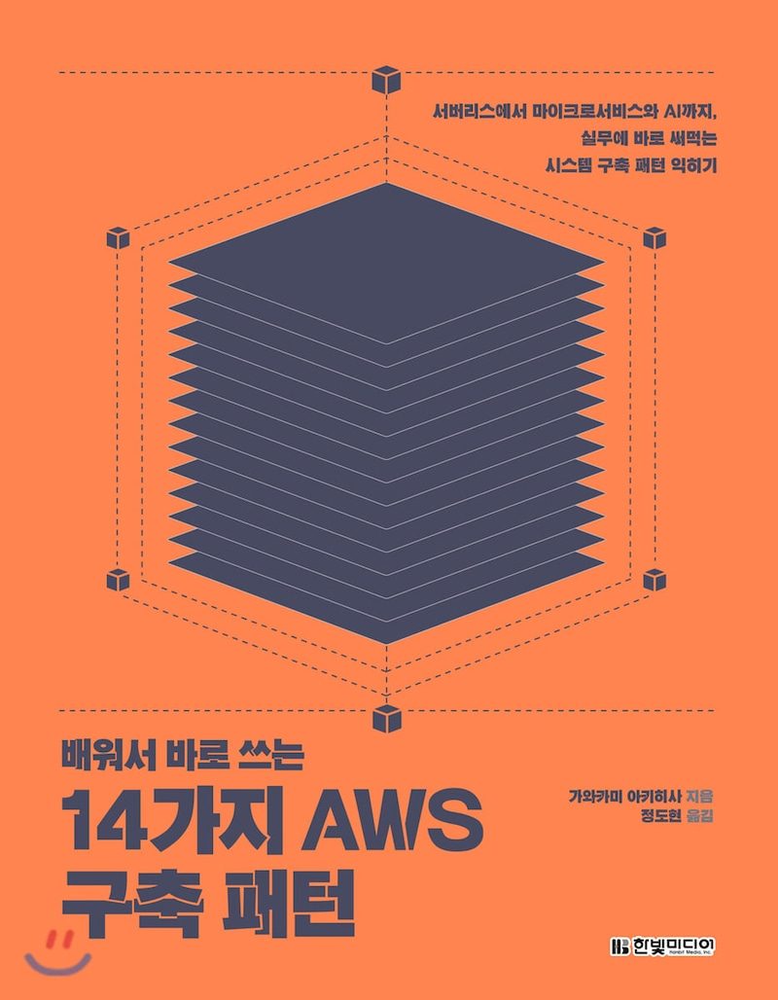

<h1 align="center">
   
  
   
  배워서 바로 쓰는 14가지 AWS 구축 패턴
   
</h1>

<h4 align="center">테라폼, awscli 이용해서 14가지 패턴 구축</h4>

  <a href="#key-features">Key Features</a> •
  <a href="#how-to-use">How To Use</a> •
  <a href="#license">License</a>

## Key Features

* 테라폼을 이용해서 14가지 패턴 구축
- [ ] 패턴1 이벤트 사이트
- [ ] 패턴2 기업 웹사이트
- [ ] 패턴3 성능을 중시하는 인트라 웹
- [ ] 패턴4 가용성을 중시한 인트라 웹
- [ ] 패턴5 백업
- [ ] 패턴6 파일 서버
- [ ] 패턴7 구조화된 데이터 분석 
- [ ] 패턴8 비구조화된 데이터 분석
- [ ] 패턴9 AI와 IoT
- [ ] 패턴10 서버 애플리케이션 쾌속 개발
- [ ] 패턴11 모바일 앱 쾌속 개발
- [ ] 패턴12 서버리스 인프라
- [ ] 패턴13 마이크로서비스 운영
- [ ] 패턴14 온프레미스 환경과 연계하기
 
## How To Use

### Requirements

* terraform v0.12.23 + provider.aws v3.14.1
* awscli 1.18.172

## License

MIT
